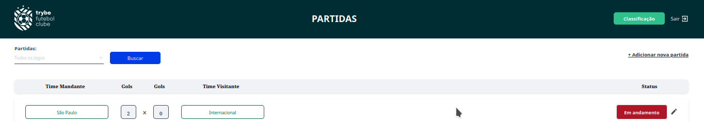
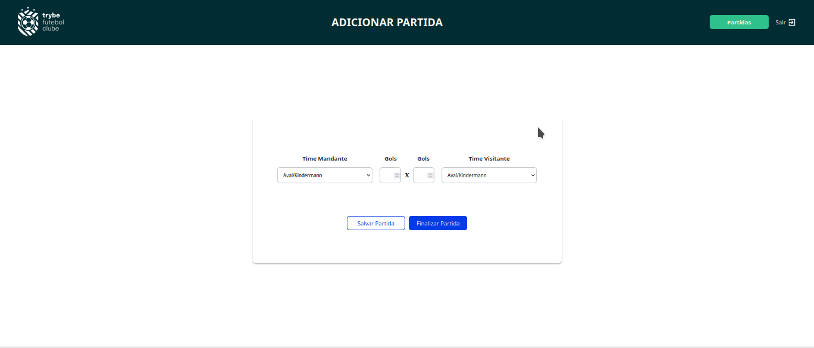
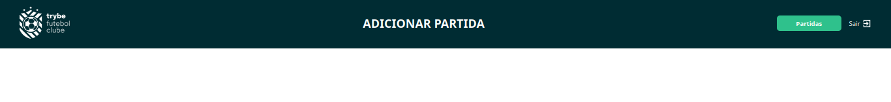
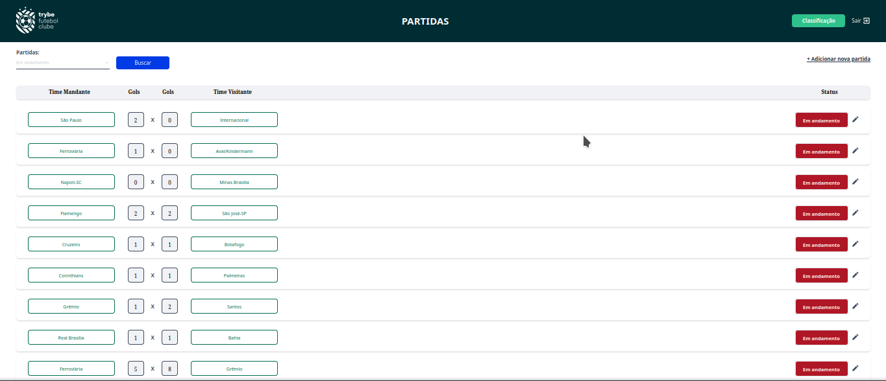

 <h1>Projeto TFC<h1>

 # Sobre
O projeto **TFC** é um sistema informativo de futebol que permite registrar partidas, cadastrar times e exibir a tabela de classificação do campeonato.

## Tecnologias utiliazadas no front-end
- Desenvolvido pela **Trybe**
## Tecnologias utilizadas no back-end
- Docker /Docker Compose
- Node.js
- express
- sequelize
- typeScript
- POO (Classes)

## Como baixar o projeto
1. Clone o repostório
```Bash
 git clone git@github.com:lucas852757/tfc.git
```
2. Entre no repositório que você acabou de clonar:
```Bash
cd tfc
```
3. Instale as dependencias [caso existam]:
```Bash
npm install
```

# Testando a aplicação
<details>
  <summary>
    Antes de testar o projeto
  </summary>

  - Antes de testar o projeto, crie o arquivo .env na pasta backend em /app. Este arquivo é importante, porque contém variávies de ambientes utilizadas por esta aplicação:
  ```Bash
  JWT_SECRET=jwt_secret
  APP_PORT=3001
  DB_USER=seu_user
  DB_PASS=sua_senha
  DB_HOST=localhost 
  DB_PORT=3002

  ```
</details>

## Como testar o projeto com o Docker
 - Antes de começar, seu docker-compose precisa estar na versção 1.29 ou superior. Veja [aqui](https://www.digitalocean.com/community/tutorials/how-to-install-and-use-docker-compose-on-ubuntu-20-04-pt) ou na [documentação](https://docs.docker.com/compose/install/) como instalá-lo.
- Execute o comando npm run compose:up para subir container com projeto.
```Bash
  tfc/ npm run compose:up
```
- Para encerrar a execução do projeto basta executar o comando npm run  compose:
```Bash
  tfc/ npm run compose:down
```
# Funcionamento da aplicação:
## Tela de Classificação
Aqui podemos acessar a classificação dos times pela Classificação Geral, Classificação Mandantes e Classificação Visitantes:


## Tela de Partidas
Aqui podemos selecionar todas as partidas (andamento, finalizado), partidas em andamento e partidas finalizadas:


## Tela de Login
Nesta tela, podemos fazer o nosso login de usuário.</br>

Administrador -> login: admin@admin.com senha: secret_admin </br>
Usuário -> login: user@user.com senha: secret_user </br>
Vamos digitar admin@dmin.com para o login e **secret_admin** para a senha.</br>
Logado como administrador, podemos agora adicionar novas partidas e editar partidas.
Exemplo:</br>
 - Vá em **+Adicionar nova partida** que está localizado no canto superior direito.

 - Click em **+Adicionoar nova partida**.
 - Após clicar em **+Adicionar nova partida**, você verá a tela de adicionar nova partida.
 
 - Adicione a partida desejada e salve-a.
 
 - Click no botão **Partidas** que está localizado no canto superior direito da tela.
 
 - Na tela de **Partidas** busque por partidas em andamento, visto que não finalizamos a partida entre Ferroviária vs Grêmio.
 

 # Executando Testes
 - Dentro da pasta app/backend, execute o comando npm run test
 ```Bash
  tfc/app/backend npm run test
 ```
